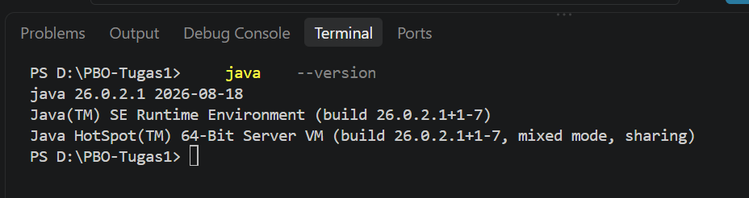
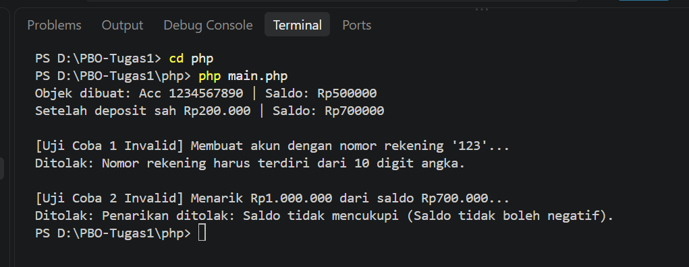
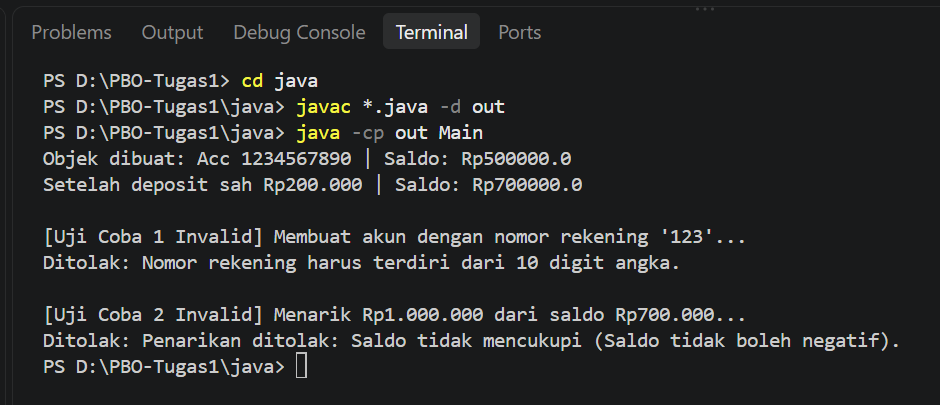

# Laporan Praktikum	P01	—	Lingkungan	Kerja	dan	Kelas	Berinvarian 
|	|	| 
|---|---| 
| **Nama**	|	Theofani Natanya Anari Hutabarat	| 
|	**NPM**	|	4525210074	| 
|	**Kelas**	|	PBO - A	| 
|	**Sistem	operasi**	|	Windows	11	| 

---

1.	Verifikasi	Lingkungan	Kerja 

###	1.1	Versi	Java 
Perintah	yang	dijalankan:				
java	--version 

Keluaran:		

    PS D:\PBO-Tugas1>     java    --version
    java 26.0.2.1 2026-08-18
    Java(TM) SE Runtime Environment (build 26.0.2.1+1-7)
    Java HotSpot(TM) 64-Bit Server VM (build 26.0.2.1+1-7, mixed mode, sharing)
    PS D:\PBO-Tugas1> 

 

###	1.2	Versi	PHP 

Perintah	yang	dijalankan:	

    php	--version 

Keluaran:	

    PS D:\PBO-Tugas1>         php    --version
    PHP 8.4.25 (cli) (built: Aug 25 2026 18:38:23) (NTS Visual C++ 2022 x64)
    Copyright (c) The PHP Group
    Built by The PHP Group
    Zend Engine v4.4.25, Copyright (c) Zend Technologies
    PS D:\PBO-Tugas1>  
    

---

## 2.	Hasil	Checkpoint	1 

###	2.1	Java 

Perintah:				
    cd	java				
    javac	*.java	-d	out				
    java	-cp	out	Main 

Keluaran:				
    
    PS D:\PBO-Tugas1> cd java
    PS D:\PBO-Tugas1\java> javac *.java -d out
    PS D:\PBO-Tugas1\java> java -cp out Main
    Objek dibuat: Acc 1234567890 | Saldo: Rp500000.0
    Setelah deposit sah Rp200.000 | Saldo: Rp700000.0

    [Uji Coba 1 Invalid] Membuat akun dengan nomor rekening '123'...
    Ditolak: Nomor rekening harus terdiri dari 10 digit angka.

    [Uji Coba 2 Invalid] Menarik Rp1.000.000 dari saldo Rp700.000...
    Ditolak: Penarikan ditolak: Saldo tidak mencukupi (Saldo tidak boleh negatif).
    PS D:\PBO-Tugas1\java> 

 

###	2.2	PHP 

Perintah:	

    cd	php				
    php	index.php 

Keluaran:		

    PS D:\PBO-Tugas1> cd php
    PS D:\PBO-Tugas1\php> php main.php
    Objek dibuat: Acc 1234567890 | Saldo: Rp500000
    Setelah deposit sah Rp200.000 | Saldo: Rp700000

    Uji Coba 1 Invalid] Membuat akun dengan nomor rekening '123'...
    Ditolak: Nomor rekening harus terdiri dari 10 digit angka.

    [Uji Coba 2 Invalid] Menarik Rp1.000.000 dari saldo Rp700.000...
    Ditolak: Penarikan ditolak: Saldo tidak mencukupi (Saldo tidak boleh negatif).
    PS D:\PBO-Tugas1\php> 

 

###	2.3	Invarian	yang	saya	tegakkan 

1.	balance >= 0 (Saldo tidak boleh negatif)
    Java: BankAccount.java 
    PHP: BankAccount.php 
2.	accountNumber harus tepat 10 digit angka
    Java: BankAccount
    PHP: BankAccount

---

##	3.	Hasil	Checkpoint	2 

Perintah:				
    cd	java				
    javac	*.java	-d	out				
    java	-cp	out	Main 

Keluaran:				
    
    PS D:\PBO-Tugas1> cd java
    PS D:\PBO-Tugas1\java> javac *.java -d out
    PS D:\PBO-Tugas1\java> java -cp out Main
    Objek dibuat: Acc 1234567890 | Saldo: Rp500000.0
    Setelah deposit sah Rp200.000 | Saldo: Rp700000.0

    [Uji Coba 1 Invalid] Membuat akun dengan nomor rekening '123'...
    Ditolak: Nomor rekening harus terdiri dari 10 digit angka.

    [Uji Coba 2 Invalid] Menarik Rp1.000.000 dari saldo Rp700.000...
    Ditolak: Penarikan ditolak: Saldo tidak mencukupi (Saldo tidak boleh negatif).
    PS D:\PBO-Tugas1\java> 

Perintah:	

    cd	php				
    php	index.php 

Keluaran:		

    PS D:\PBO-Tugas1> cd php
    PS D:\PBO-Tugas1\php> php main.php
    Objek dibuat: Acc 1234567890 | Saldo: Rp500000
    Setelah deposit sah Rp200.000 | Saldo: Rp700000

    Uji Coba 1 Invalid] Membuat akun dengan nomor rekening '123'...
    Ditolak: Nomor rekening harus terdiri dari 10 digit angka.

    [Uji Coba 2 Invalid] Menarik Rp1.000.000 dari saldo Rp700.000...
    Ditolak: Penarikan ditolak: Saldo tidak mencukupi (Saldo tidak boleh negatif).
    PS D:\PBO-Tugas1\php> 

---

##	4.	Kendala	dan	Cara	Mengatasinya 

terdapat kesalahan, error atau bingung dan mengatasi dengan bertanya ke teman 

---

##	5.	Deklarasi	Penggunaan	AI 
(Tulis	salah	satu:)
-	Menggunakan	chat gpt	untuk	memberikan contoh - contoh.	Contoh	pertanyaan	yang	saya	ajukan:	"contoh - contoh rancangan class menurut tugas". Deklarasi	yang	jujur	tidak	mengurangi	nilai.