# LAPORAN PRAKTIKUM PBO - A

NAMA        : Theofani Natanya Anari Hutabarat

NPM         : 4525210074

MATA KULIAH : Pemograman Berbasis Objek

KELAS       : A

MATERI      : Pertemuan02

DOSEN       : Adi Wahyu Pribadi, S.Si., M.Kom

## Java
a. Mahasiswa.java

Kelas Mahasiswa digunakan untuk menyimpan data mahasiswa berupa NIM, nama, nilai tugas, nilai UTS, dan nilai UAS. Atribut nim dibuat final karena tidak boleh berubah setelah data mahasiswa dibuat. Setiap nilai divalidasi agar berada pada rentang 0–100 sehingga data yang disimpan tetap valid. Nilai akhir dihitung menggunakan bobot 30% tugas, 30% UTS, dan 40% UAS, kemudian digunakan untuk menentukan huruf mutu mahasiswa.

Screenshot = 

- Before :
  
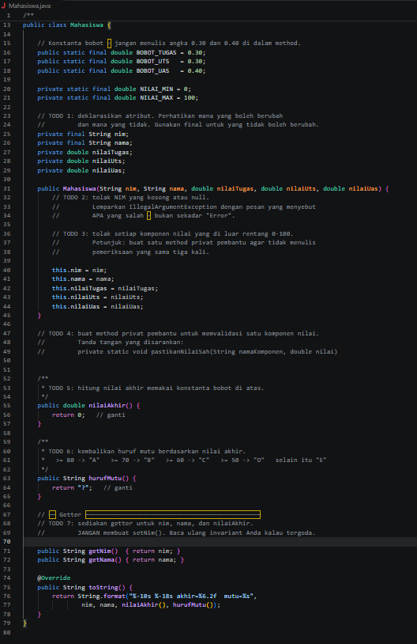

TODO 1 digunakan untuk membuat atribut pada kelas Mahasiswa. Atribut nim dibuat final karena tidak boleh berubah setelah mahasiswa terdaftar.
TODO 2 digunakan untuk memeriksa apakah NIM kosong atau null. Jika tidak valid, program harus menolak data dengan IllegalArgumentException.
TODO 3 digunakan untuk memastikan nilai tugas, UTS, dan UAS berada pada rentang 0 sampai 100. Jika ada nilai di luar batas tersebut, data tidak boleh disimpan.
TODO 4 membuat method bantuan untuk validasi nilai agar kode tidak ditulis berulang kali pada setiap komponen nilai.
TODO 5 digunakan untuk menghitung nilai akhir menggunakan bobot 30% tugas, 30% UTS, dan 40% UAS.
TODO 6 digunakan untuk menentukan huruf mutu berdasarkan nilai akhir yang diperoleh mahasiswa, mulai dari A sampai E.
TODO 7 digunakan untuk menyediakan getter agar data seperti NIM, nama, dan nilai akhir dapat dibaca dari luar kelas tanpa mengubah isi datanya.

- After :
  
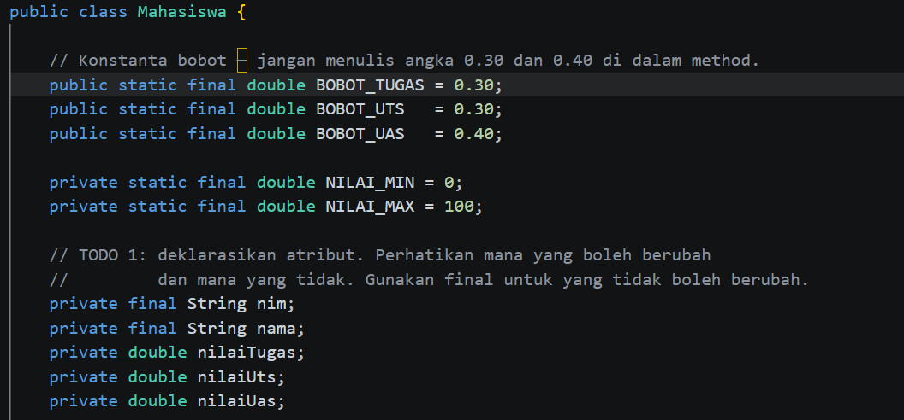

Pada TODO 1 dilakukan pembuatan atribut nim, nama, nilaiTugas, nilaiUts, dan nilaiUas. Atribut nim dibuat menggunakan final karena tidak boleh berubah setelah data mahasiswa dibuat.

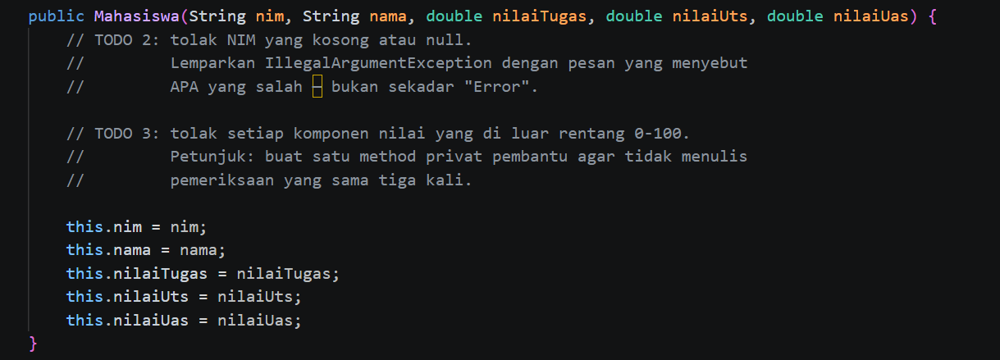

Pada TODO 2 dan TODO 3 ditambahkan validasi untuk memastikan NIM tidak kosong serta semua nilai berada pada rentang 0 sampai 100. Jika data tidak sesuai aturan, program akan menolak data tersebut dengan IllegalArgumentException.

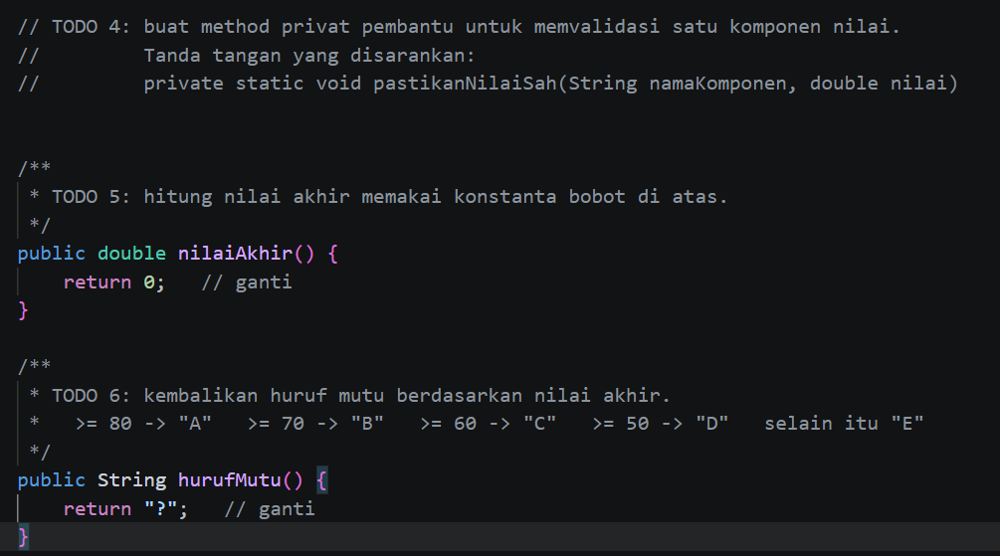

Pada TODO 4 dibuat method privat pastikanNilaiSah() untuk memeriksa validitas nilai sehingga kode lebih rapi dan tidak berulang.
Pada TODO 5 ditambahkan perhitungan nilai akhir berdasarkan bobot 30% tugas, 30% UTS, dan 40% UAS.
Pada TODO 6 ditambahkan method untuk menentukan huruf mutu A, B, C, D, atau E sesuai nilai akhir mahasiswa.

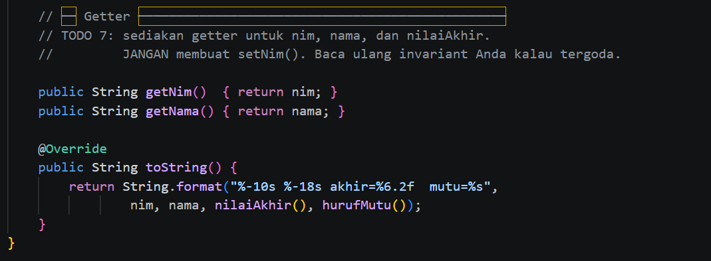

Pada TODO 7 ditambahkan getter untuk mengakses data NIM, nama, dan nilai akhir tanpa mengubah isi atribut yang sudah tersimpan.

b. Main.java

Program ini dipakai buat ngetes apakah kelas Mahasiswa sudah berjalan dengan benar. Pertama, program membuat beberapa data mahasiswa lalu menampilkan nilai akhirnya. Setelah itu, program mencoba memasukkan data yang salah, seperti nilai lebih dari 100 dan NIM kosong, untuk memastikan sistem bisa menolak data yang tidak sesuai aturan.

Screenshot = 

- Before :
  
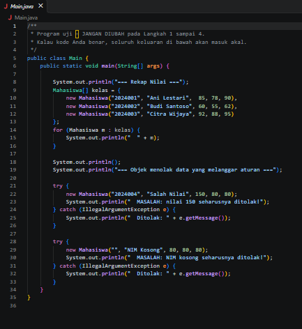

Program Main dipakai untuk mencoba kelas Mahasiswa yang sudah dibuat. Pertama, program menampilkan data beberapa mahasiswa beserta nilai akhir dan huruf mutunya. Setelah itu, program mencoba memasukkan data yang tidak sesuai aturan, seperti nilai di atas 100 dan NIM kosong, untuk melihat apakah validasi pada kelas Mahasiswa sudah bekerja dengan benar.

- After :
  
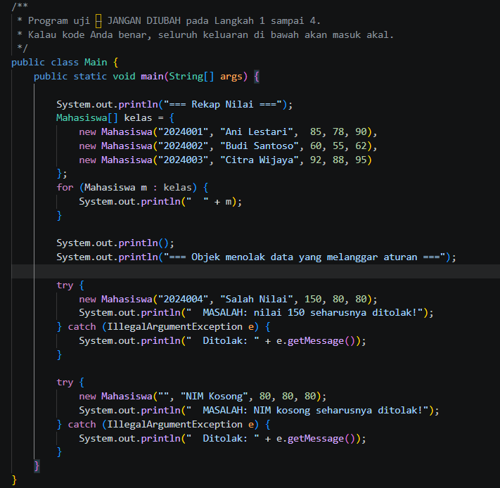

Pada kelas Main, dibuat beberapa objek Mahasiswa untuk menguji apakah program sudah berjalan sesuai ketentuan. Data mahasiswa yang valid akan ditampilkan beserta nilai akhir dan huruf mutunya. Selain itu, program juga menguji proses validasi dengan memasukkan nilai yang melebihi batas dan NIM yang kosong. Jika validasi berhasil, program akan menolak data tersebut dan menampilkan pesan kesalahan.

## PHP
a. Mahasiswa.php

Bukti Screenshot =

- Before :
- 
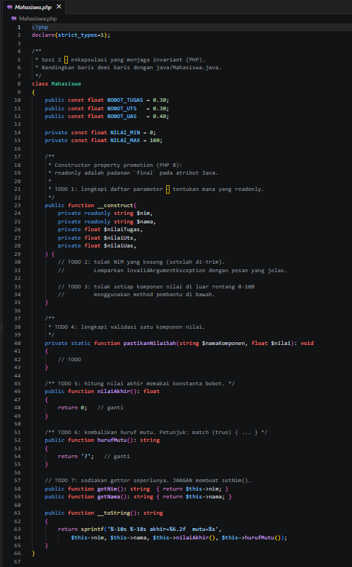

Pada TODO 1 ditambahkan atribut nim, nama, nilaiTugas, nilaiUts, dan nilaiUas menggunakan constructor property promotion. Atribut nim dan nama dibuat readonly agar tidak dapat diubah setelah objek dibuat.
Pada TODO 2 dan TODO 3 ditambahkan validasi untuk memastikan NIM tidak kosong serta nilai tugas, UTS, dan UAS berada pada rentang 0 sampai 100.
Pada TODO 4 dibuat method pastikanNilaiSah() untuk memeriksa validitas nilai sehingga proses validasi tidak perlu ditulis berulang kali.
Pada TODO 5 ditambahkan perhitungan nilai akhir menggunakan bobot 30% tugas, 30% UTS, dan 40% UAS.
Pada TODO 6 ditambahkan method untuk menentukan huruf mutu berdasarkan nilai akhir mahasiswa.
Pada TODO 7 ditambahkan getter untuk mengambil data NIM dan nama tanpa mengubah nilai atribut yang sudah ada.

- After :
  
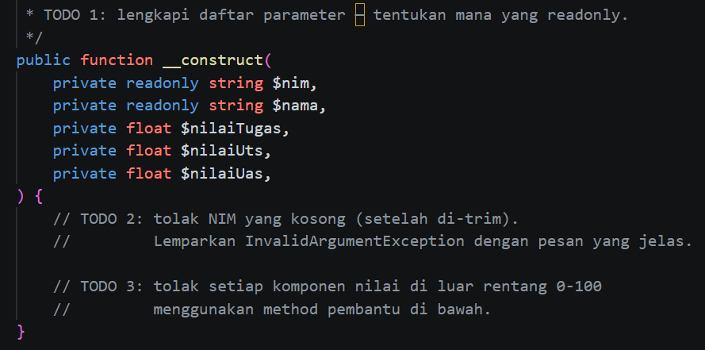

Pada TODO 1 ditentukan atribut yang digunakan untuk menyimpan data mahasiswa. Atribut nim dan nama dibuat readonly sehingga nilainya tidak dapat diubah setelah objek dibuat.
Pada TODO 2 dan TODO 3 ditambahkan validasi untuk memastikan NIM tidak kosong dan seluruh nilai berada pada rentang 0 sampai 100.

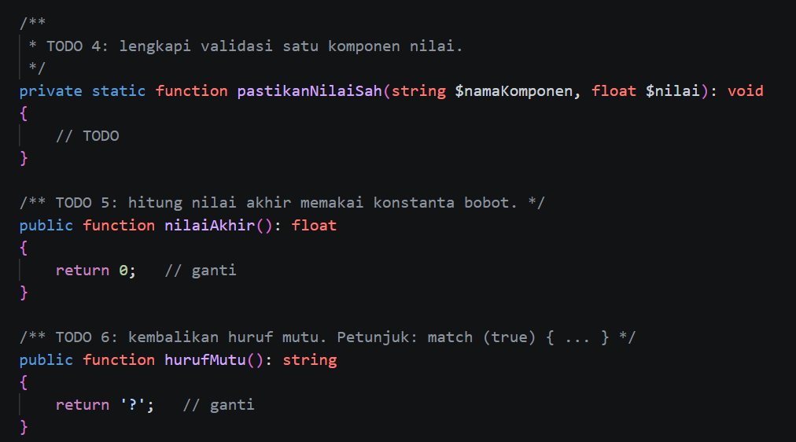

Pada TODO 4 dibuat method pastikanNilaiSah() agar proses validasi nilai dapat digunakan kembali tanpa menulis kode yang sama berulang kali.
Pada TODO 5 ditambahkan perhitungan nilai akhir berdasarkan bobot tugas 30%, UTS 30%, dan UAS 40%.
Pada TODO 6 ditambahkan fungsi untuk menentukan huruf mutu berdasarkan nilai akhir yang diperoleh mahasiswa.

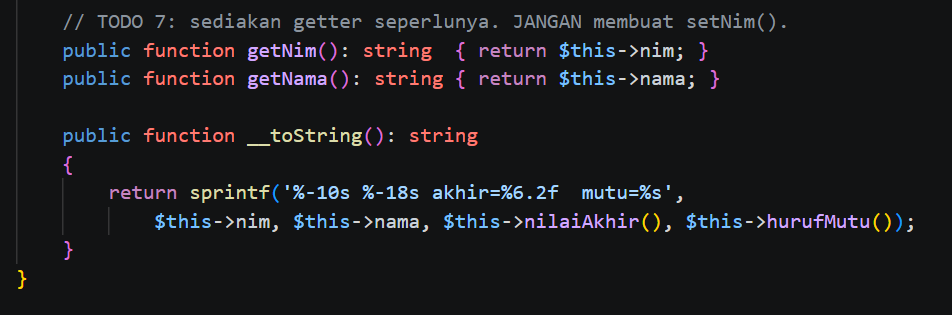

Pada TODO 7 ditambahkan getter untuk mengambil data NIM dan nama, tanpa memberikan akses untuk mengubah data tersebut.

b. Main.php

Bukti Screenshot = 

- Before :
  
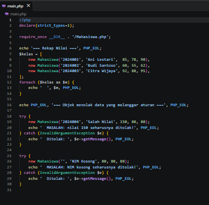

File main.php digunakan untuk menguji apakah kelas Mahasiswa sudah berjalan dengan baik. Program membuat beberapa objek mahasiswa, lalu menampilkan data mahasiswa beserta nilai akhir dan huruf mutunya. Setelah itu dilakukan pengujian dengan memasukkan data yang tidak valid, seperti nilai di atas 100 dan NIM kosong, untuk memastikan validasi yang dibuat dapat menolak data yang tidak sesuai aturan.

- After :
  
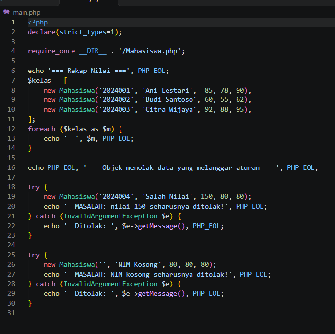

File main.php digunakan sebagai program utama untuk mencoba kelas Mahasiswa. Program membuat beberapa data mahasiswa, lalu menampilkan hasil perhitungan nilai akhir dan huruf mutunya. Selain itu, program juga menguji validasi dengan memasukkan data yang salah, seperti nilai di atas 100 dan NIM kosong, sehingga dapat diketahui apakah aturan yang dibuat sudah berjalan dengan benar.