# LAPORAN PRAKTIKUM PBO - A

NAMA        : Theofani Natanya Anari Hutabarat

NPM         : 4525210074

MATA KULIAH : Pemograman Berbasis Objek

KELAS       : A

MATERI      : Pertemuan03

DOSEN       : Adi Wahyu Pribadi, S.Si., M.Kom

## Java
a. RekeningBank.java

Kalau yang JAVA ini udah versi jadi dan udah diperbaiki semua. Angka ajaibnya udah diganti jadi konstanta pakai public static final biar rapi. Udah ada field statis jumlahRekening buat ngitung objek. Constructornya ada dua, yang ringkas manggil yang lengkap pakai this() jadi gak dobel hitung. Validasi udah lengkap, nomor gak boleh kosong, saldo gak boleh minus, setor tarik harus positif, tarik gak boleh lebih dari saldo dan gak boleh lebih dari 5 juta. Potong admin juga udah aman gak bikin saldo minus karena pakai Math.max.

Screenshot = 

- Before :
  
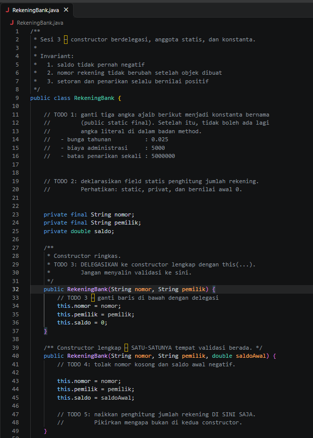
TODO 1 digunakan untuk membuat atribut pada kelas Mahasiswa. Atribut nim dibuat final karena tidak boleh berubah setelah mahasiswa terdaftar.
TODO 2 digunakan untuk memeriksa apakah NIM kosong atau null. Jika tidak valid, program harus menolak data dengan IllegalArgumentException.
TODO 3 digunakan untuk memastikan nilai tugas, UTS, dan UAS berada pada rentang 0 sampai 100. Jika ada nilai di luar batas tersebut, data tidak boleh disimpan.
TODO 4 membuat method bantuan untuk validasi nilai agar kode tidak ditulis berulang kali pada setiap komponen nilai.
TODO 5 digunakan untuk menghitung nilai akhir menggunakan bobot 30% tugas, 30% UTS, dan 40% UAS.

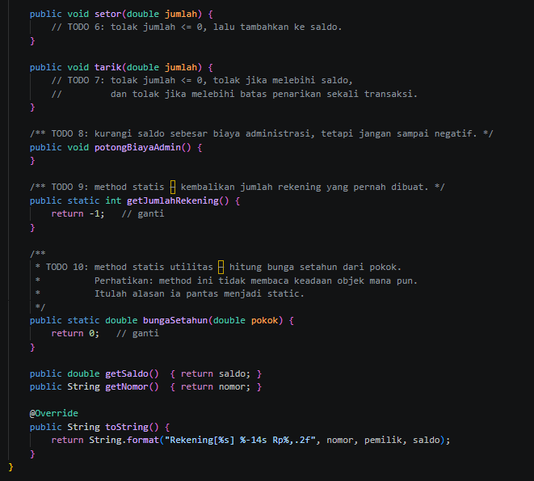
TODO 6 digunakan untuk menentukan huruf mutu berdasarkan nilai akhir yang diperoleh mahasiswa, mulai dari A sampai E.
TODO 7 digunakan untuk menyediakan getter agar data seperti NIM, nama, dan nilai akhir dapat dibaca dari luar kelas tanpa mengubah isi datanya.

- After :
  
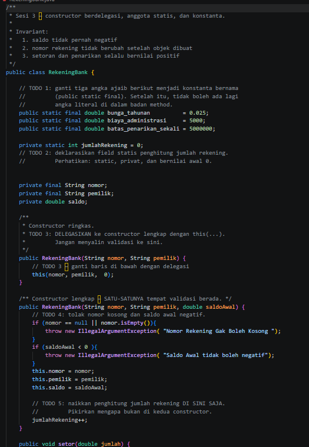
TODO 1 digunakan untuk mendefinisikan konstanta bunga_tahunan, biaya_administrasi, dan batas_penarikan_sekali menggunakan public static final agar nilai acak (magic numbers) tidak digunakan langsung di dalam method.
TODO 2 digunakan untuk mendeklarasikan field statis jumlahRekening bertipe private static int dengan nilai awal 0 untuk menghitung total objek rekening yang pernah dibuat.
TODO 3 digunakan untuk menerapkan delegasi constructor pada constructor ringkas dengan memanggil this(nomor, pemilik, 0) agar tidak terjadi duplikasi kode validasi.
TODO 4 digunakan untuk memeriksa apakah nomor rekening bernilai null atau kosong, serta memastikan saldo awal tidak bernilai negatif dengan melempar IllegalArgumentException jika tidak valid.
TODO 5 digunakan untuk menaikkan nilai variabel jumlahRekening++ khusus di dalam constructor lengkap agar total rekening tidak terhitung dua kali saat constructor ringkas dipanggil.

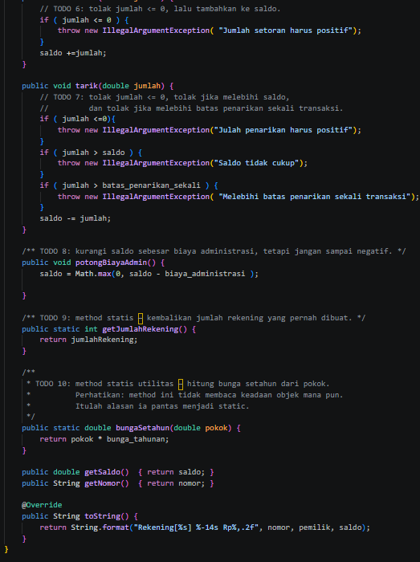
TODO 6 digunakan untuk mengecek dan menolak jumlah setoran yang bernilai kurang dari atau sama dengan nol sebelum ditambahkan ke saldo.
TODO 7 digunakan untuk menolak transaksi penarikan jika jumlahnya kurang dari atau sama dengan nol, melebihi sisa saldo, atau melebihi batas penarikan sekali transaksi.
TODO 8 digunakan untuk memotong saldo sebesar biaya administrasi dengan memastikan nilai saldo tidak bernilai negatif menggunakan Math.max.
TODO 9 digunakan untuk menyediakan method statis getJumlahRekening guna mengembalikan total rekening yang telah dibuat.
TODO 10 digunakan untuk menyediakan method statis utilitas bungaSetahun guna menghitung perkalian antara nilai pokok dengan konstanta bunga tahunan.

b. Main.java

Main di JAVA ini udah jadi alat tes final. Di sini dibikin 3 objek yaitu Ani, Budi, Citra buat buktiin kalau jumlahRekening kehitung 3 bukan 4. Terus ada tes setor 500rb ke Ani, tes tarik 9 juta yang harusnya ditolak, tes potong admin di Budi yang saldonya 0 biar gak minus, sama tes hitung bunga setahun pakai method static. Jadi Main JAVA ini buat nunjukin kalau semua perbaikan di class RekeningBank udah berhasil.

Screenshot = 

- Before :
  
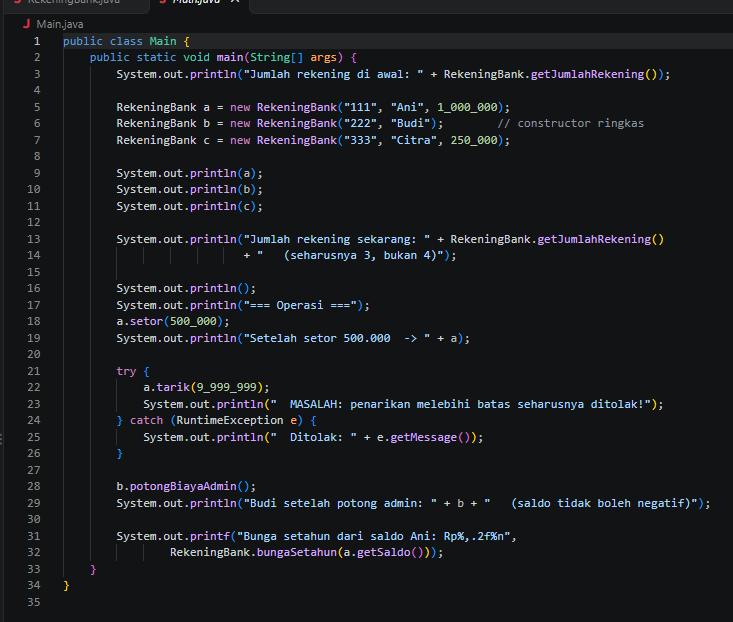
Sebelum diperbaiki, pas program Main dijalankan hasilnya masih berantakan. Jumlah rekening yang kebaca itu 4, padahal yang dibuat cuma 3 rekening yaitu Ani, Budi, dan Citra. Terus pas coba tarik uang 9 juta dari saldo Ani yang cuma 1,5 juta, penarikannya masih bisa lolos harusnya kan ditolak. Sama juga pas rekening Budi yang saldonya 0 dipotong biaya admin, saldonya jadi minus. Jadi validasinya belum jalan.

- After :
  
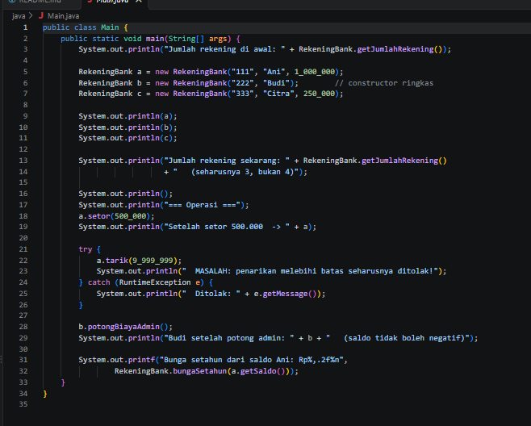
Sesudah diperbaiki di bagian RekeningBank, semua jadi normal. Jumlah rekening sekarang sudah kebaca 3 sesuai yang dibuat. Penarikan yang melebihi saldo sudah otomatis ditolak dan muncul pesan error. Potong biaya admin juga sudah aman, saldo Budi tidak jadi minus tetap 0. Untuk bunga setahun juga sudah bisa dihitung dengan benar. Jadi program sudah sesuai sama yang diminta di soal.

## PHP
a. RekeningBank.php

Kode PHP ini masih mentah dan belum jadi. Semua method masih TODO dan belum ada isinya, jadi cuma kerangka doang. Konstanta bunga, biaya admin, sama batas tarik belum dibikin, masih pakai angka langsung. Jumlah rekening juga belum kehitung karena properti statisnya belum ada. Constructornya cuma satu tapi pakai default parameter karena di PHP emang gak bisa bikin dua constructor. Method setor, tarik, sama potong admin masih kosong jadi belum ada validasi sama sekali.

Bukti Screenshot =

- Before :
- 
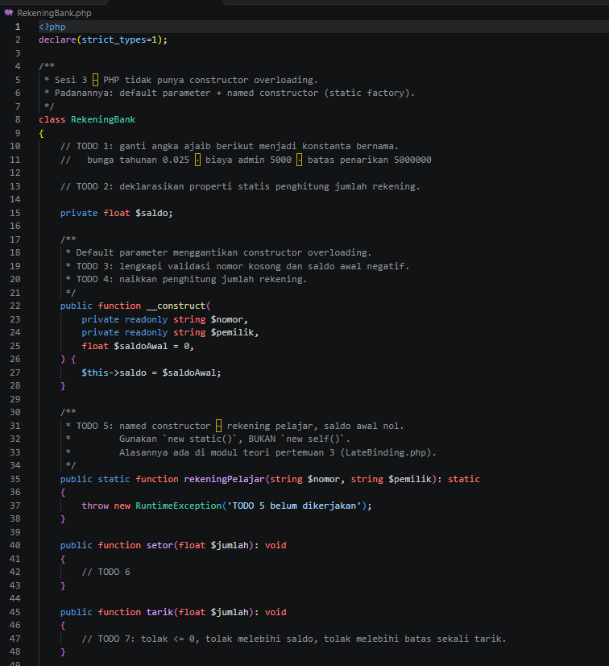
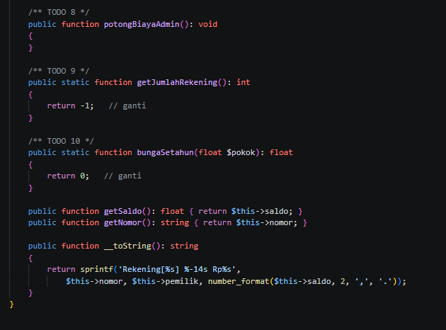
Kode awalnya masih pakai PHP dan semuanya masih TODO. Jadi belum ada konstanta untuk bunga, biaya admin, sama batas tarik. Penghitung jumlah rekening juga belum dibikin. Constructor masih berantakan, validasi nomor kosong sama saldo negatif belum ada. Method setor, tarik, potongBiayaAdmin, getJumlahRekening, sama bungaSetahun semuanya masih kosong atau return asal. Intinya program belum bisa jalan sesuai studi kasus.

- After :
  
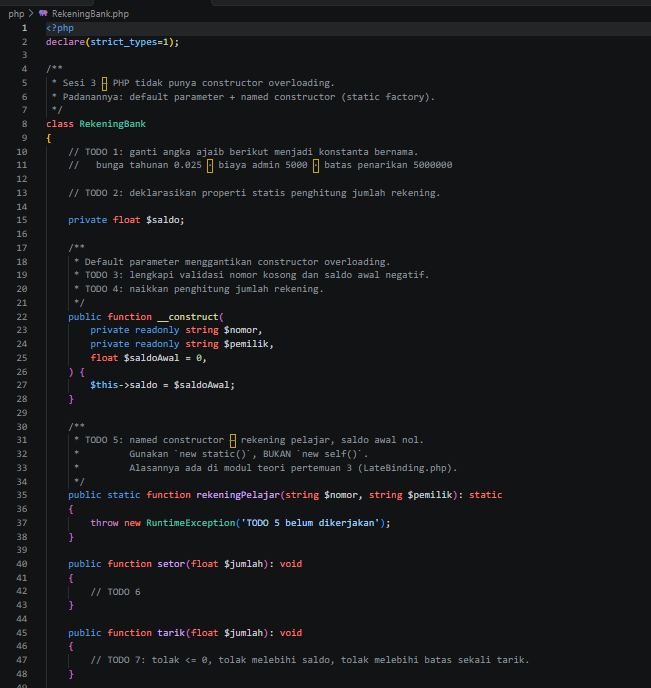
TO DO 1 & 2. Angka ajaib diganti jadi konstanta bunga_tahunan, biaya_administrasi, batas_penarikan_sekali dan ditambah field static jumlahRekening untuk menghitung objek.
TO DO 3, 4, & 5. Constructor ringkas didelegasikan pakai this(nomor, pemilik, 0) biar gak duplikat kode. Validasi nomor kosong dan saldo negatif hanya di constructor lengkap, dan increment jumlahRekening++ juga hanya di situ biar gak kehitung dobel.
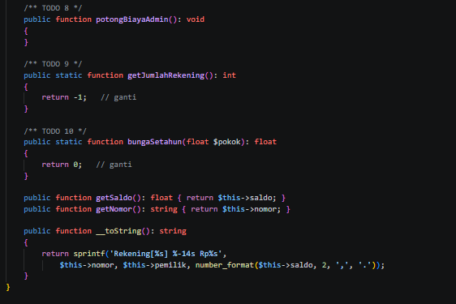
TO DO6 & 7. setor dan tarik diberi validasi harus > 0. Untuk tarik ditambah 2 validasi lagi yaitu tidak boleh melebihi saldo dan tidak boleh melebihi batas 5 juta.
TO DO 8. potongBiayaAdmin pakai Math.max(0, saldo - biaya) agar saldo tidak minus.
TO DO 9 & 10. getJumlahRekening dan bungaSetahun dijadikan static karena tidak tergantung pada data objek tertentu.

b. Main.php

Main di PHP itu fungsinya buat ngetes class RekeningBank yang masih TODO. Jadi pas dijalanin pasti masih error atau return -1 karena getJumlahRekening sama bungaSetahun belum dibenerin. Biasanya main PHP cuma echo jumlah rekening, bikin objek baru, terus coba setor tarik, tapi karena validasinya belum ada hasilnya masih ngaco.

Bukti Screenshot = 

- Before :
  
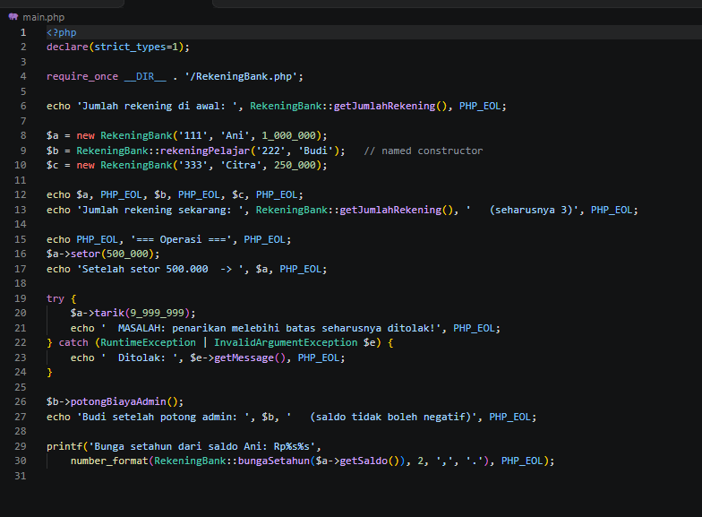
Sebelum class RekeningBank diperbaiki, Main PHP ini pas dijalanin hasilnya masih salah semua. Jumlah rekening di awal bukan 0 tapi -1 karena getJumlahRekening() masih return asal. Pas bikin 3 rekening, jumlahnya gak jadi 3 karena penghitungnya belum jalan dan named constructor rekeningPelajar() masih throw error TODO. Operasi setor gak nambah saldo, tarik 9 juta masih lolos gak ketolak, potong admin bikin saldo minus, sama bunga setahun return 0.

- After :
  
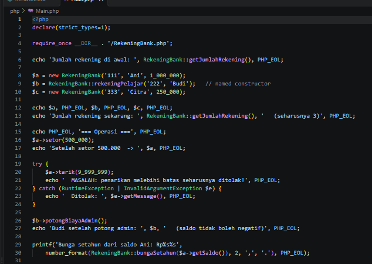
Sesudah RekeningBank diperbaiki, Main PHP ini udah jalan normal. Jumlah awal 0, setelah bikin Ani, Budi, Citra jumlahnya jadi 3 sesuai harapan. Ani setor 500rb saldonya jadi 1,5jt. Tarik 9jt langsung ketolak dan muncul pesan Ditolak. Budi yang saldo 0 pas dipotong admin tetap 0 gak minus. Bunga setahun dari saldo Ani juga udah kehitung bener pakai 2,5%.
