# LAPORAN PRAKTIKUM PBO - A

NAMA        : Theofani Natanya Anari Hutabarat

NPM         : 4525210074

MATA KULIAH : Pemograman Berbasis Objek

KELAS       : A

MATERI      : Pertemuan04

DOSEN       : Adi Wahyu Pribadi, S.Si., M.Kom

## Java
a. Dosen.java

Screenshot = 

- After :
  
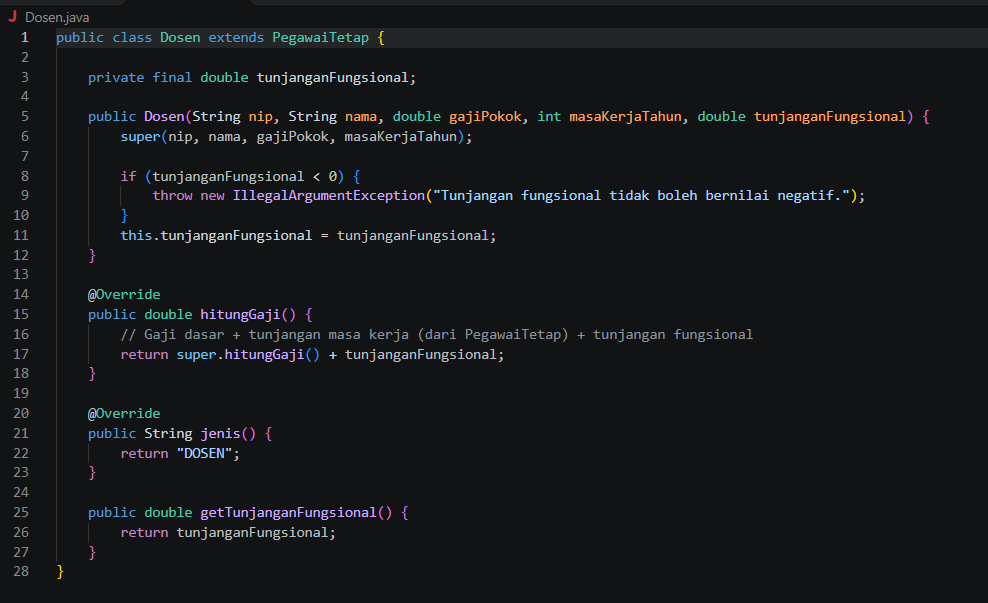

Class Dosen merupakan subclass dari PegawaiTetap yang menambahkan komponen gaji berupa tunjanganFungsional. Class ini melakukan validasi pada konstruktor agar tunjanganFungsional tidak bernilai negatif. Method hitungGaji() di-override untuk menjumlahkan total gaji dasar beserta tunjangan masa kerja (dari super.hitungGaji()) dengan tunjanganFungsional, serta mengembalikan tipe jenis pegawai sebagai "DOSEN" melalui method jenis().

b. Main.java

Screenshot = 

- Before :
  
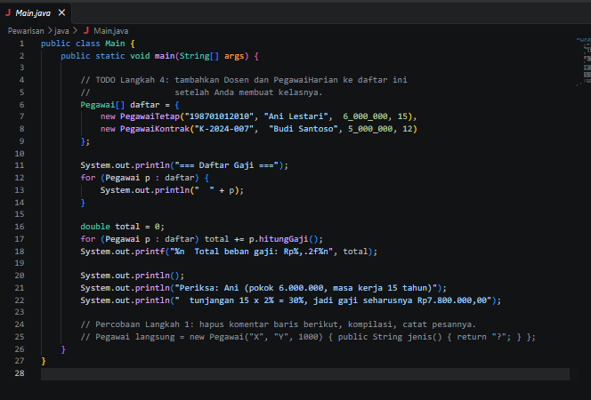

Array daftar pada class Main hanya memuat dua objek turunan pegawai, yaitu PegawaiTetap ("Ani Lestari") dan PegawaiKontrak ("Budi Santoso"). Objek Dosen dan PegawaiHarian belum dimasukkan dan masih berupa instruksi komentar TODO Langkah 4.

- After :
  
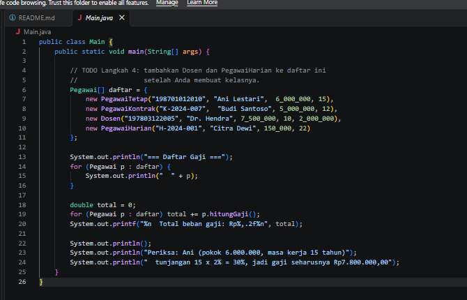

Array daftar pada class Main telah diperbarui dengan menambahkan dua objek baru, yaitu new Dosen(...) ("Dr. Hendra") dan new PegawaiHarian(...) ("Citra Dewi"). Perubahan ini membuat program berhasil mengeksekusi perhitungan gaji secara polimorfik untuk seluruh jenis pegawai secara lengkap.

c. Pegawai.jawa

Screenshot = 

- Before :
  
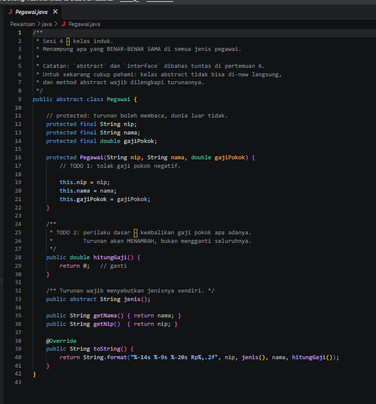

Konstruktor pada class Pegawai belum menerapkan validasi sehingga masih membolehkan input gajiPokok bernilai negatif, dan method hitungGaji() masih mengembalikan nilai default 0.

- After :
  
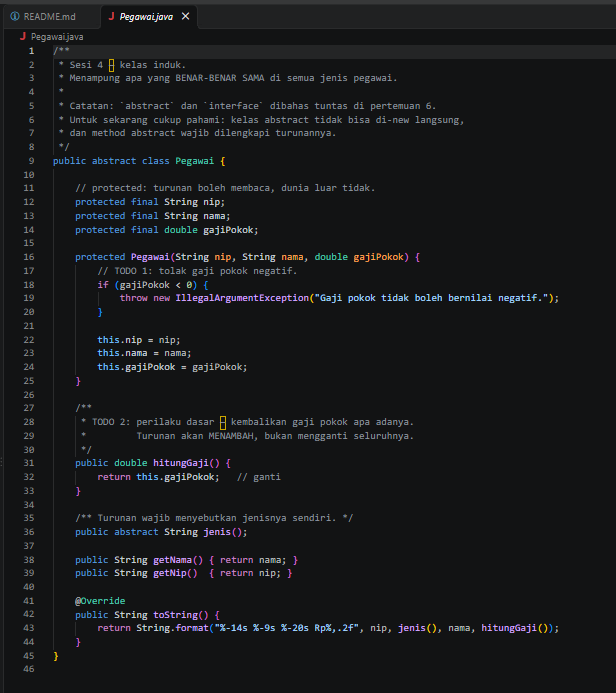

Konstruktor pada class Pegawai telah ditambahkan validasi if (gajiPokok < 0) yang akan melemparkan IllegalArgumentException jika ditemukan nilai negatif, serta method hitungGaji() telah diperbarui untuk mengembalikan nilai this.gajiPokok sebagai perilaku dasar perhitungan gaji.

d. PegawaiHarian.java

Screenshot = 

- After :
  
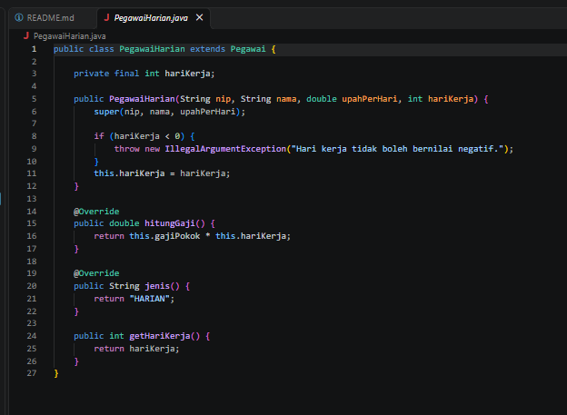

Class PegawaiHarian merupakan subclass dari Pegawai yang merepresentasikan pegawai dengan sistem gaji harian. Class ini memiliki atribut hariKerja bertipe final dengan validasi dalam konstruktor untuk memastikan nilainya tidak negatif. Perhitungan gaji dilakukan dengan mengalikan gaji pokok (upah per hari) dengan total hari kerja, serta mengimplementasikan method jenis() yang mengembalikan string "HARIAN".

e. PegawaiKontrak.java

Screenshot = 

- Before :
  
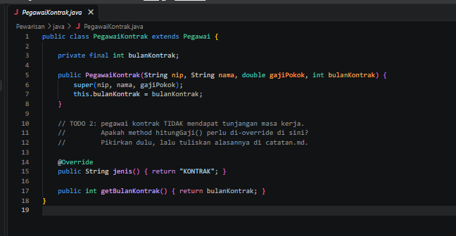

Pada file PegawaiKontrak.java, baris instruksi TODO 2 masih berupa pertanyaan mengenai apakah method hitungGaji() perlu di-override untuk pegawai kontrak yang tidak mendapat tunjangan masa kerja.

- After :
  
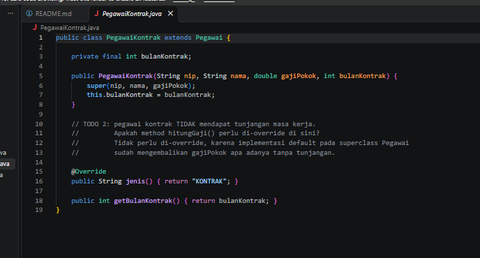

Komentar pada TODO 2 telah dilengkapi dengan jawaban atau alasan bahwa method hitungGaji() tidak perlu di-override, karena implementasi default pada superclass Pegawai sudah mengembalikan nilai gajiPokok apa adanya tanpa tambahan tunjangan

f. PegawaiTetap.java

Screenshot = 

- Before :
  
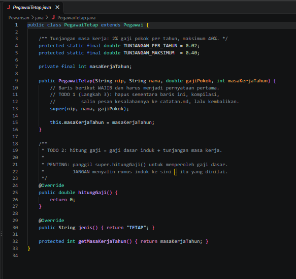

Pada class PegawaiTetap, method hitungGaji() masih berupa kerangka awal yang mengembalikan nilai 0 dan belum berisi logika perhitungan gaji.

- After :
  

Method hitungGaji() pada class PegawaiTetap telah diimplementasikan secara lengkap dengan memanggil super.hitungGaji() untuk mendapatkan gaji dasar, menghitung persentase tunjangan masa kerja (dengan batas maksimum 40% menggunakan Math.min), dan mengembalikan total keseluruhan gaji.

## PHP
a. Pegawai.php

Bukti Screenshot =

- Before :
  
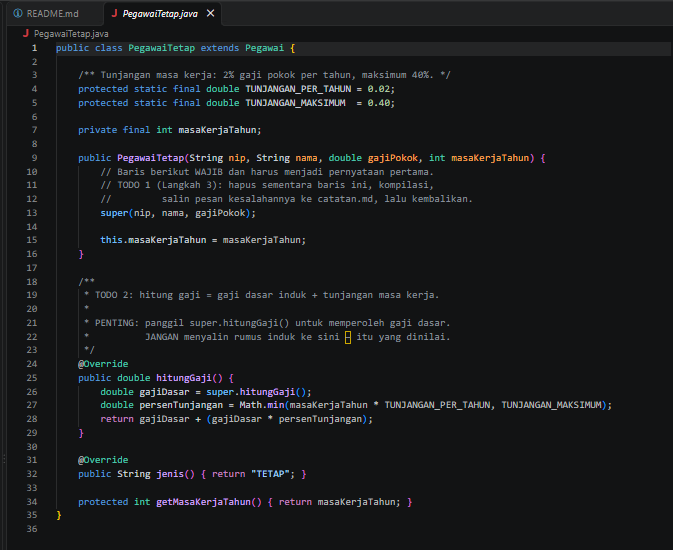
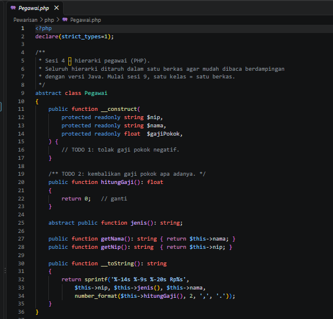

konstruktor kelas abstrak Pegawai belum menerapkan validasi pada parameter $gajiPokok (sehingga masih membolehkan nilai negatif pada TODO 1), dan method hitungGaji(): float masih mengembalikan nilai default 0 pada TODO 2.

- After :
  
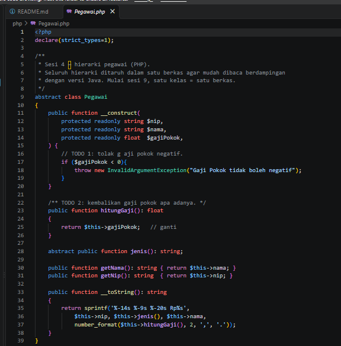
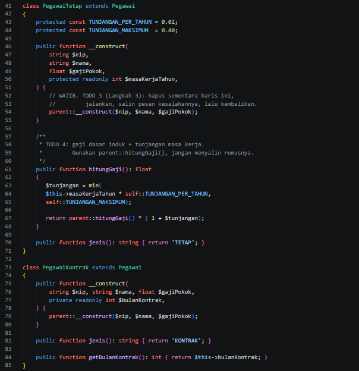
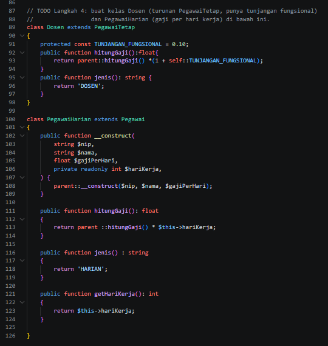

Konstruktor telah ditambahkan validasi if ($gajiPokok < 0) yang melemparkan InvalidArgumentException, serta method hitungGaji(): float diperbarui untuk mengembalikan nilai $this->gajiPokok.

b. Main.php

Bukti Screenshot = 

- Before :
  
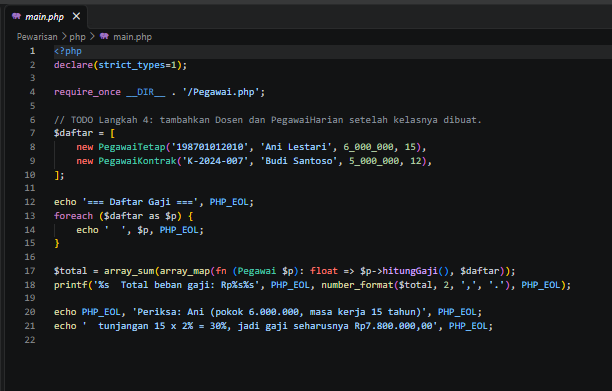

Array $daftar pada file main.php baru memuat dua objek pegawai, yaitu PegawaiTetap ("Ani Lestari") dan PegawaiKontrak ("Budi Santoso"), sedangkan instansiasi untuk Dosen dan PegawaiHarian masih berupa komentar instruksi (TODO).

- After :
  
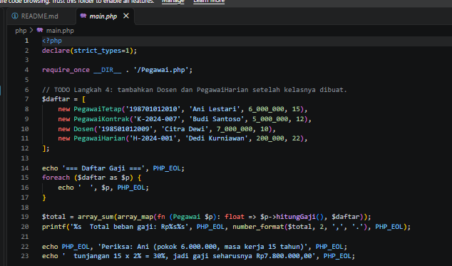

Array $daftar pada file main.php telah diperbarui dengan menambahkan objek new Dosen(...) ("Citra Dewi") dan new PegawaiHarian(...) ("Dedi Kurniawan") secara lengkap sehingga program dapat memproses perhitungan seluruh data pegawai.