# LAPORAN PRAKTIKUM PBO - A

NAMA        : Theofani Natanya Anari Hutabarat

NPM         : 4525210074

MATA KULIAH : Pemograman Berbasis Objek

KELAS       : A

MATERI      : Pertemuan05

DOSEN       : Adi Wahyu Pribadi, S.Si., M.Kom

## Java

a. AntiPattern.java

Screenshot = 

- Before :

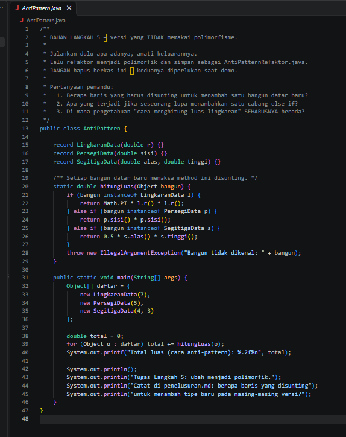

perhitungan luas bangun datar dilakukan menggunakan if-else dan instanceof untuk memeriksa tipe objek. Setiap kali ada bangun datar baru, method hitungLuas() harus diubah dengan menambahkan cabang kondisi baru, sehingga kode menjadi kurang fleksibel dan sulit dikembangkan.

- After :
  
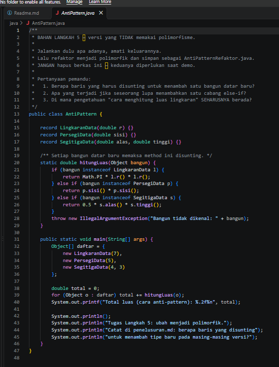

program direfaktor menggunakan konsep polimorfisme dengan membuat interface atau kelas induk yang memiliki method luas(). Setiap bangun datar mengimplementasikan perhitungan luasnya masing-masing sehingga tidak diperlukan lagi pengecekan tipe objek menggunakan if-else maupun instanceof. Kode menjadi lebih rapi, mudah dipelihara, dan lebih mudah dikembangkan.

b. AntiPatternRefaktor.java

Screenshot = 

- After :
  
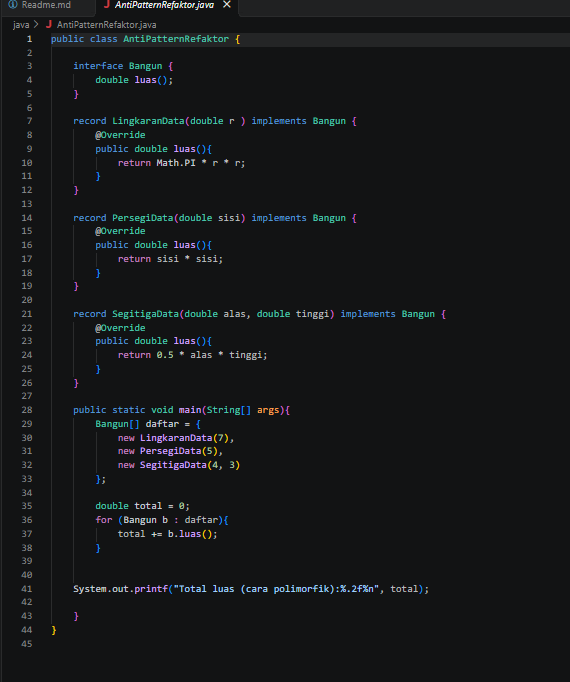

Setelah dilakukan refactoring, program menerapkan konsep polimorfisme dengan membuat interface Bangun yang memiliki method luas(). Setiap bangun datar seperti LingkaranData, PersegiData, dan SegitigaData mengimplementasikan method tersebut sesuai rumus masing-masing. Dengan cara ini, program tidak lagi menggunakan if-else atau instanceof untuk menentukan perhitungan luas. Kode menjadi lebih rapi, mudah dikembangkan, dan sesuai dengan prinsip Object-Oriented Programming (OOP).

c. BangunDatar.java

Screenshot = 

- Before :
  
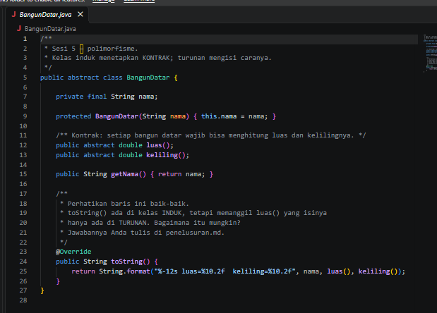

Perhitungan luas dilakukan dengan pengecekan tipe objek menggunakan if-else dan instanceof, sehingga kode sulit dikembangkan ketika terdapat bangun datar baru. 

- After :
  
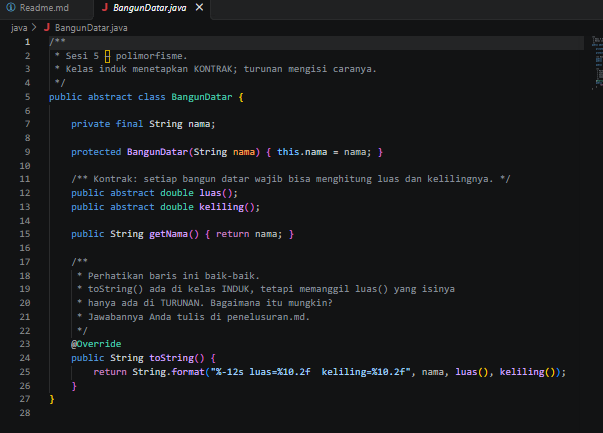

Perhitungan luas dan keliling dilakukan menggunakan polimorfisme melalui method yang diimplementasikan oleh setiap kelas turunan, sehingga kode lebih fleksibel, terstruktur, dan mudah diperluas.

d. Lingkaran.java

Screenshot = 

- Before :
  
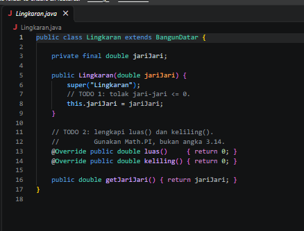

Class Lingkaran masih berupa kerangka program. Validasi jari-jari belum ada dan method luas() serta keliling() belum diimplementasikan.

- After :
  
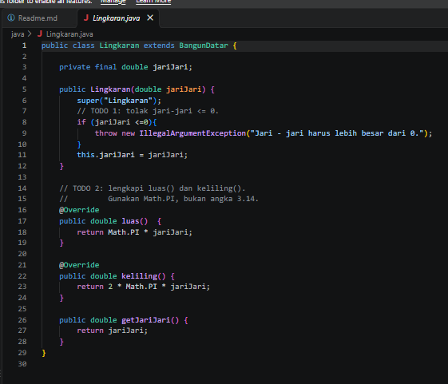

Class Lingkaran telah dilengkapi validasi input dan implementasi rumus luas serta keliling menggunakan Math.PI, sehingga dapat berfungsi sesuai kebutuhan program.

e. Main.java

Screenshot = 

- Before :
  
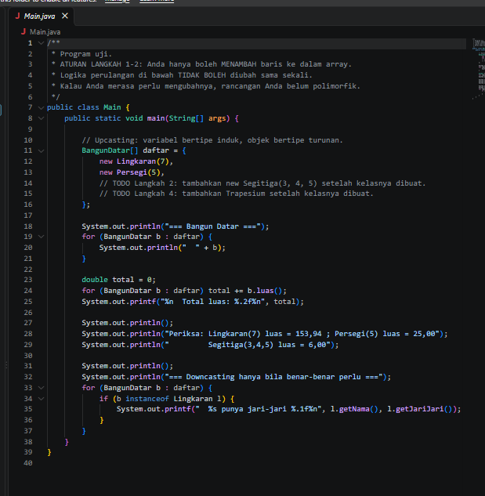

Array BangunDatar hanya berisi objek Lingkaran dan Persegi, sehingga program belum mengolah bangun datar lain.

- After :
  
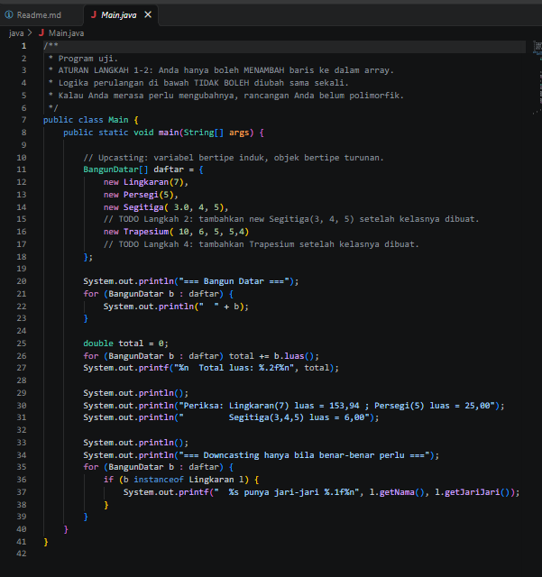

Objek Segitiga berhasil ditambahkan ke dalam array BangunDatar tanpa mengubah kode perulangan dan perhitungan, membuktikan bahwa polimorfisme bekerja dengan baik.

f. Persegi.java

Screenshot = 

- Before :
  
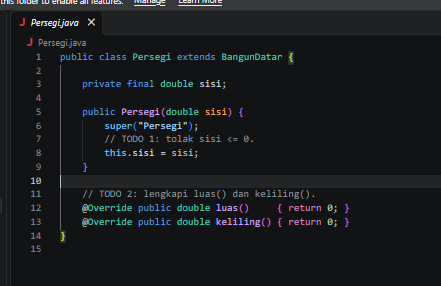

Class Persegi belum memiliki validasi nilai sisi dan method luas() serta keliling() masih belum diimplementasikan.

- After :
  
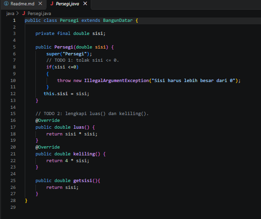

Class Persegi telah dilengkapi validasi input serta implementasi rumus luas dan keliling, sehingga dapat digunakan untuk menghitung nilai persegi dengan benar.

g. Segitiga.java

Screenshot = 

- After :
  
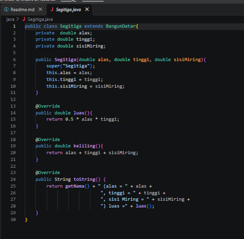

Class Segitiga berhasil ditambahkan sebagai turunan BangunDatar dengan implementasi method luas() dan keliling(). Penambahan kelas baru ini dapat dilakukan tanpa mengubah logika utama program, sehingga menunjukkan penerapan konsep polimorfisme yang baik.

h. Trapesium.java

Screenshot = 

- After :
  
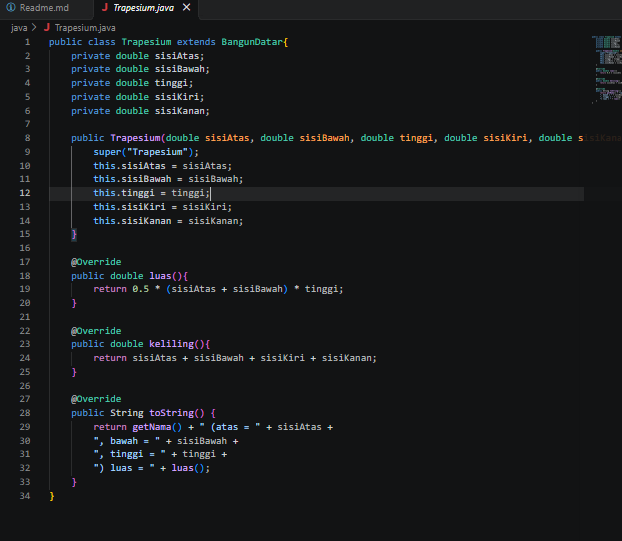

Class Trapesium berhasil ditambahkan sebagai turunan BangunDatar dengan implementasi method luas() dan keliling(). Penambahan bangun datar baru dapat dilakukan tanpa mengubah kode yang sudah ada, menunjukkan penerapan polimorfisme yang baik dan membuat program lebih mudah dikembangkan.

## PHP

a. BangunDatar.php

Bukti Screenshot =

- Before :
  
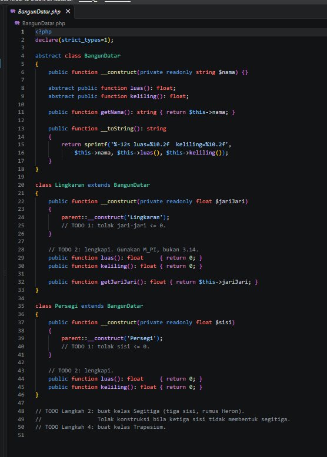

Masih berupa template awal. Perhitungan luas dan keliling belum diimplementasikan, validasi input belum tersedia, serta kelas Segitiga dan Trapesium belum dibuat.

- After :
  
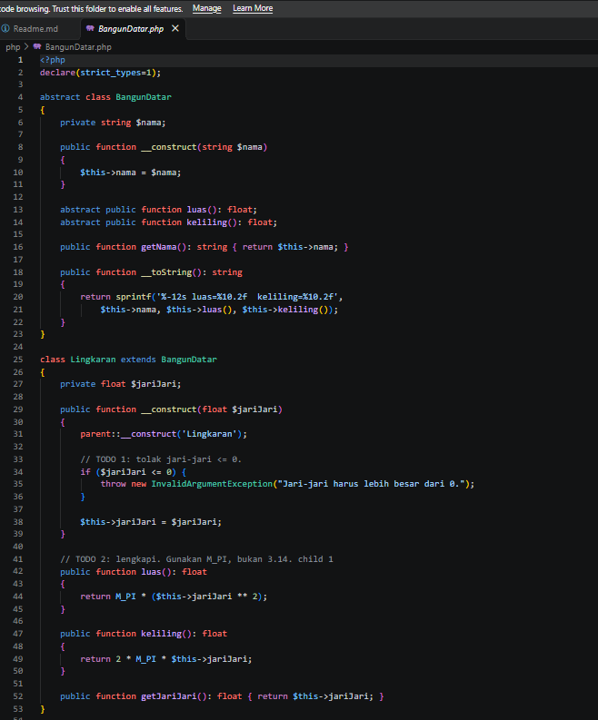
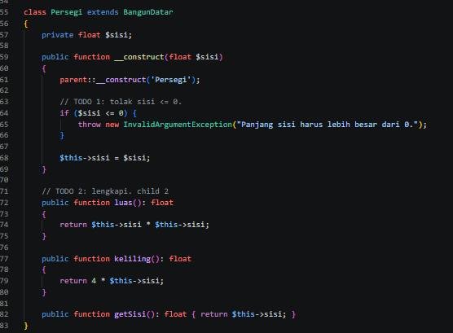
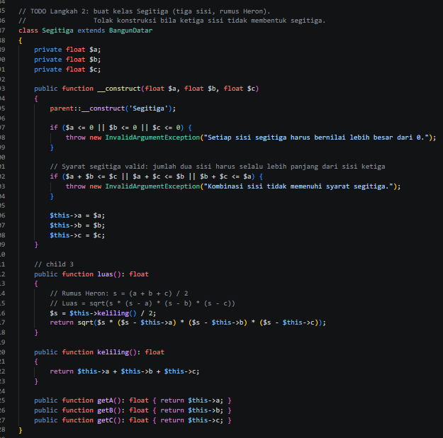
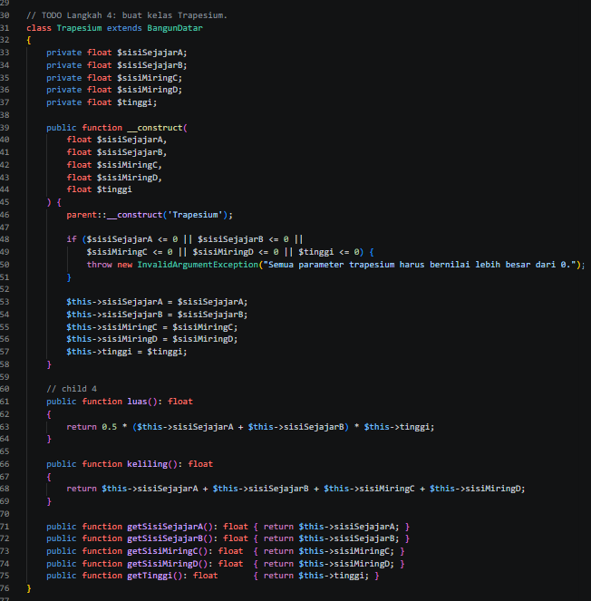
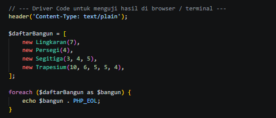

TODO 1 - Ditambahkan validasi pada Lingkaran dan Persegi agar nilai jari-jari dan sisi harus lebih besar dari 0.
TODO 2 - Method luas() dan keliling() pada Lingkaran dan Persegi telah diimplementasikan menggunakan rumus yang sesuai.
TODO Langkah 2 - Ditambahkan kelas Segitiga dengan validasi tiga sisi dan perhitungan luas menggunakan rumus Heron.
TODO Langkah 4 - Ditambahkan kelas Trapesium dengan implementasi perhitungan luas dan keliling berdasarkan atribut sisi dan tinggi.

b. main.php

Bukti Screenshot = 

- Before :
  
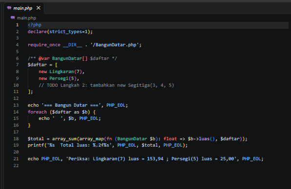

array $daftar hanya berisi objek Lingkaran dan Persegi. Program belum menampilkan maupun menghitung luas untuk objek Segitiga karena kelas tersebut belum ditambahkan ke dalam daftar bangun datar.

- After :
  
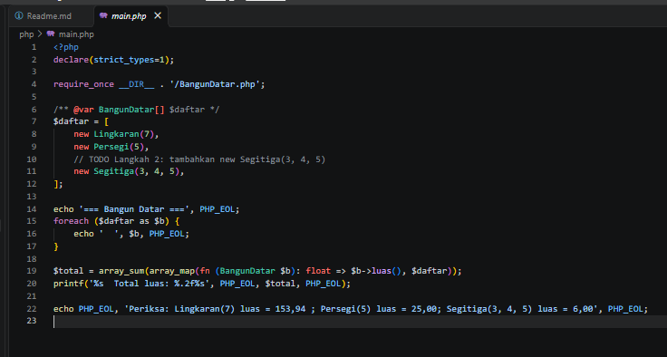

objek Segitiga(3, 4, 5) berhasil ditambahkan ke dalam array $daftar. Program dapat menampilkan informasi serta menghitung total luas bangun datar tanpa mengubah logika perulangan yang sudah ada, sehingga menunjukkan penerapan polimorfisme yang baik.

c. notifikasi.php

Screenshot = 

- After :
  
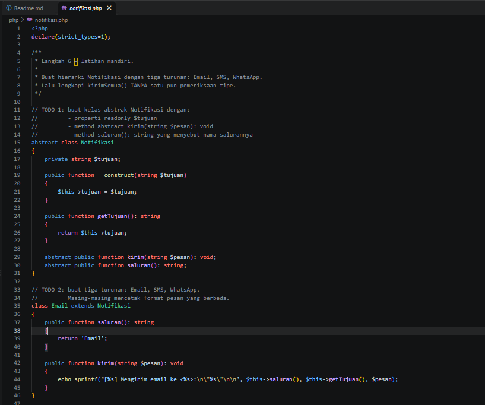
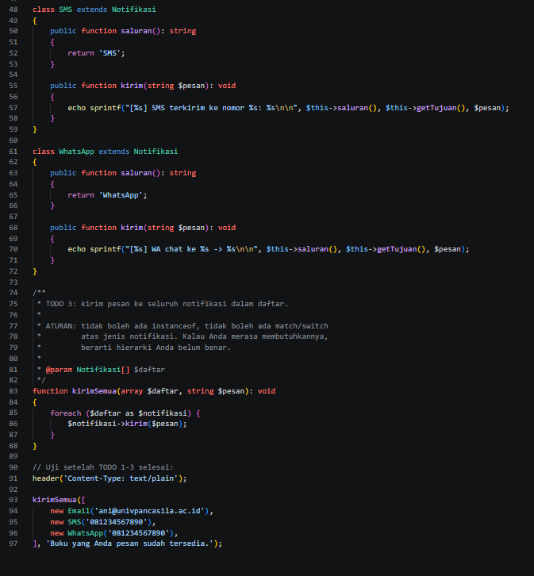

TODO 1 - Dibuat kelas abstrak Notifikasi yang berisi properti tujuan serta method abstrak kirim() dan saluran() sebagai kontrak bagi seluruh jenis notifikasi.
TODO 2 - Ditambahkan tiga kelas turunan yaitu Email, SMS, dan WhatsApp. Masing-masing mengimplementasikan method kirim() dan saluran() dengan format pengiriman pesan yang berbeda sesuai jenis notifikasinya.
TODO 3 - Fungsi kirimSemua() diimplementasikan menggunakan polimorfisme dengan memanggil method kirim() pada setiap objek notifikasi tanpa menggunakan instanceof, switch, maupun match.
