# LAPORAN PRAKTIKUM PBO - A

NAMA        : Theofani Natanya Anari Hutabarat

NPM         : 4525210074

MATA KULIAH : Pemograman Berbasis Objek

KELAS       : A

MATERI      : Pertemuan06

DOSEN       : Adi Wahyu Pribadi, S.Si., M.Kom

## Java
a. Fuelable.java

Screenshot = 

- Before :
  
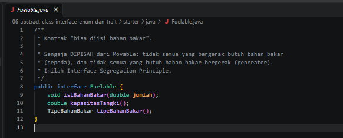

Interface Fuelable digunakan sebagai kontrak bagi objek yang dapat diisi bahan bakar. Interface ini mendefinisikan method isiBahanBakar(), kapasitasTangki(), dan tipeBahanBakar() yang harus diimplementasikan oleh setiap kelas yang menggunakannya.

- After :
  
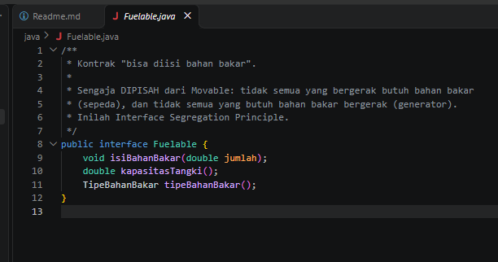

Interface Fuelable tetap digunakan sebagai kontrak untuk objek yang dapat diisi bahan bakar. Kelas yang mengimplementasikan interface ini wajib menyediakan implementasi method isiBahanBakar(), kapasitasTangki(), dan tipeBahanBakar(), sehingga perilaku pengisian bahan bakar dapat diterapkan secara konsisten.

b. Kendaraan.java

Screenshot = 

- Before :
  
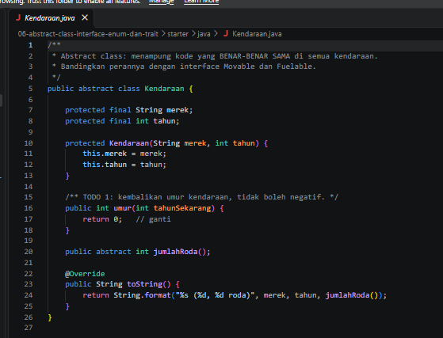

method umur() belum diimplementasikan dan selalu mengembalikan nilai 0. Akibatnya, program tidak dapat menghitung umur kendaraan berdasarkan tahun saat ini dan tahun pembuatan kendaraan.

- After :
  
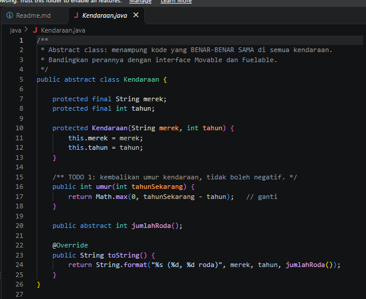

method umur() telah diimplementasikan menggunakan Math.max(0, tahunSekarang - tahun). Perubahan ini memungkinkan program menghitung umur kendaraan dengan benar serta mencegah hasil bernilai negatif apabila tahun yang dimasukkan lebih besar dari tahun sekarang.

c. Main.java

Screenshot = 

- Before :
  
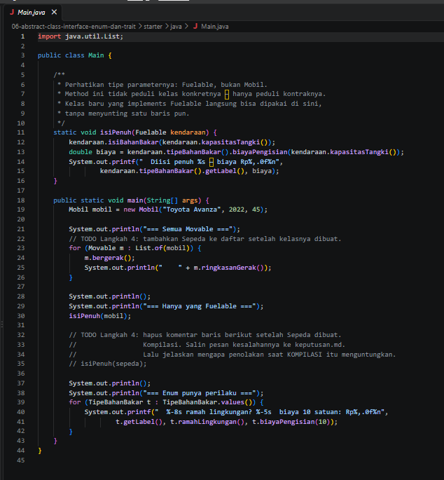

program hanya membuat objek Mobil dan menampilkannya pada daftar Movable. Selain itu, terdapat beberapa TODO yang belum dikerjakan, seperti penambahan objek Sepeda dan pengujian bahwa hanya objek yang mengimplementasikan interface Fuelable yang dapat menggunakan method isiPenuh()

- After :
  
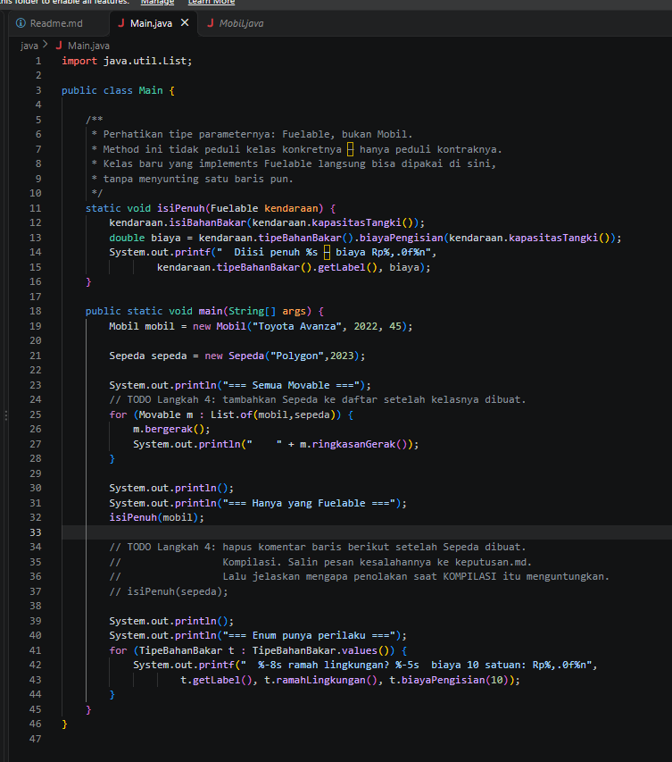

objek Sepeda telah ditambahkan ke dalam daftar Movable bersama objek Mobil. Program dapat memproses kedua objek menggunakan interface Movable tanpa bergantung pada kelas konkretnya. Selain itu, method isiPenuh() hanya dapat digunakan oleh objek yang mengimplementasikan interface Fuelable, sehingga Sepeda tidak dapat digunakan pada method tersebut. Hal ini menunjukkan penerapan Interface Segregation Principle (ISP) dan pemanfaatan polimorfisme melalui interface.

d. Mobil.java

Screenshot = 

- Before :
  
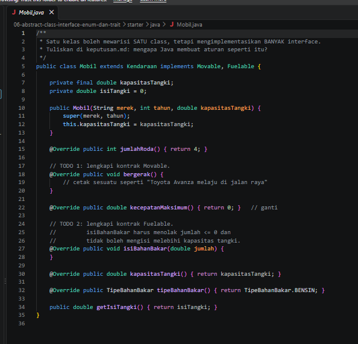

Method bergerak() belum memiliki implementasi, kecepatanMaksimum() masih mengembalikan nilai 0, dan method isiBahanBakar() masih kosong sehingga belum dapat menangani proses pengisian bahan bakar maupun validasi kapasitas tangki.

- After :
  
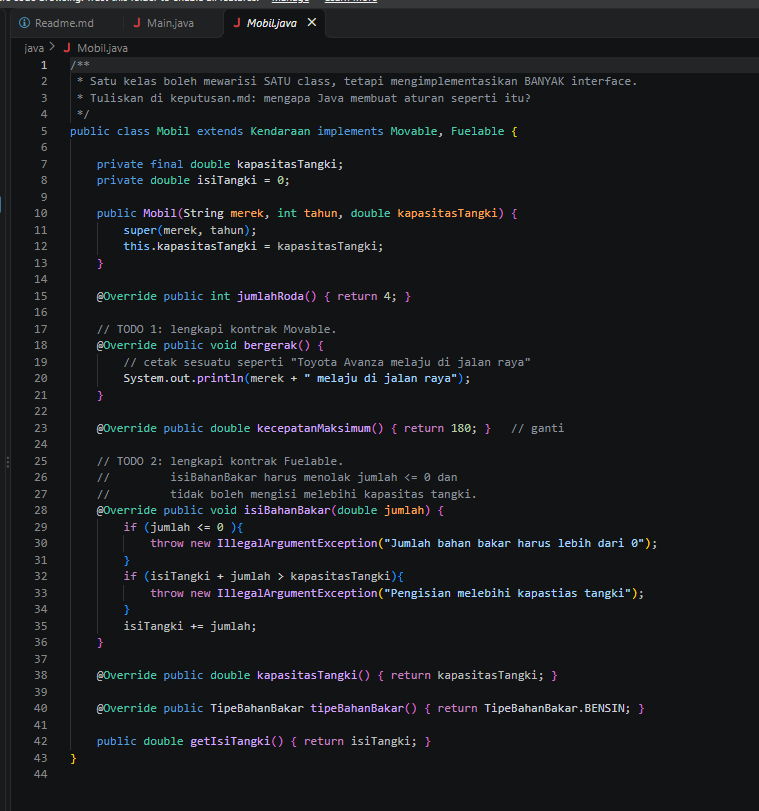

Method bergerak() telah diimplementasikan untuk menampilkan informasi pergerakan mobil, kecepatanMaksimum() telah diubah menjadi 180, dan method isiBahanBakar() telah dilengkapi validasi agar jumlah bahan bakar yang diisi harus lebih dari 0 serta tidak melebihi kapasitas tangki. Jika valid, jumlah bahan bakar akan ditambahkan ke isi tangki.

e. Movable.java

Screenshot = 

- Before :
  
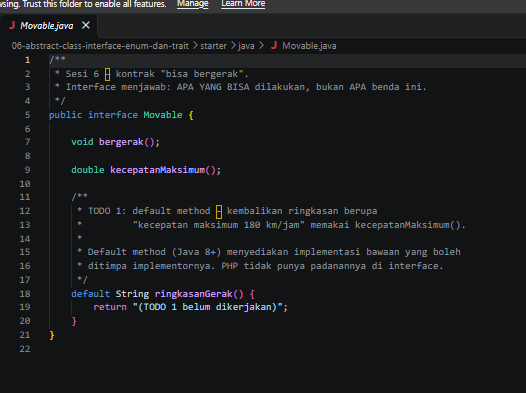

Method ringkasanGerak() masih mengembalikan teks placeholder "TODO 1 belum dikerjakan" sehingga belum menampilkan informasi kecepatan maksimum kendaraan.

- After :
  
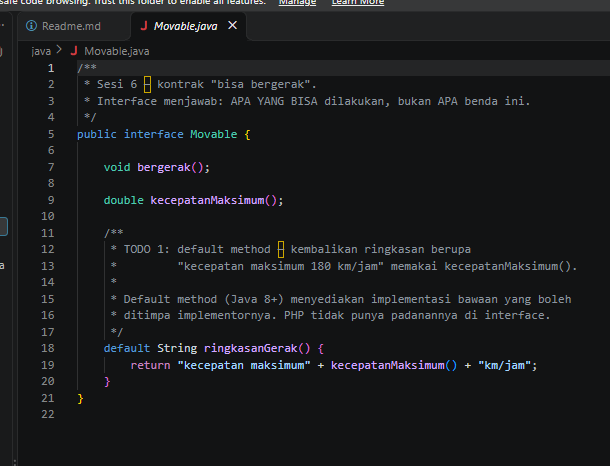

 Method ringkasanGerak() telah diimplementasikan dengan memanfaatkan method kecepatanMaksimum() untuk menghasilkan ringkasan berupa teks "kecepatan maksimum 180 km/jam", sehingga informasi kecepatan dapat ditampilkan secara dinamis sesuai nilai yang dikembalikan oleh objek yang mengimplementasikan interface Movable.

f. Sepeda.java

Screenshot = 

- After :
  
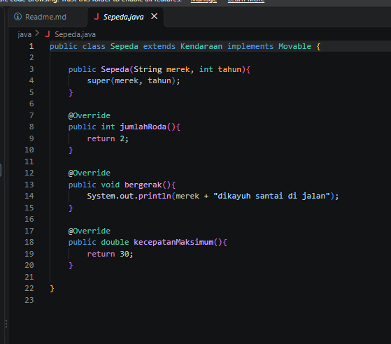

Kelas Sepeda telah diimplementasikan sebagai turunan dari Kendaraan dan implementasi interface Movable. Method jumlahRoda() mengembalikan nilai 2, method bergerak() menampilkan pesan bahwa sepeda sedang dikayuh di jalan, dan method kecepatanMaksimum() mengembalikan nilai 30 sebagai kecepatan maksimum sepeda. Dengan demikian, kelas Sepeda telah memenuhi seluruh kontrak yang didefinisikan pada interface Movable.

g. TipeBahanBakar.java

Screenshot = 

- Before :
  
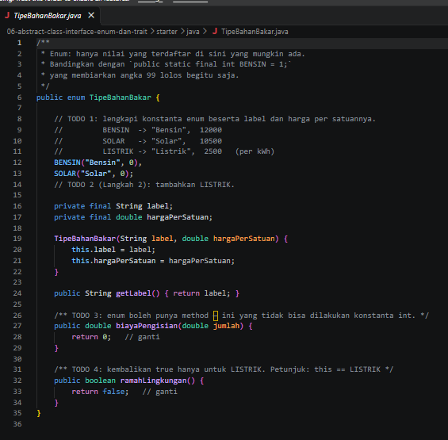

TODO 1 & 2 - Menginisialisasi konstanta enum BENSIN dan SOLAR dengan nilai harga per satuan masih bernilai awal 0, serta belum mendefinisikan konstanta enum LISTRIK
TODO 3 - Method biayaPengisian mengembalikan nilai default berupa 0.   
TODO 4 - Method ramahLingkungan mengembalikan nilai boolean false secara default.

- After :
  
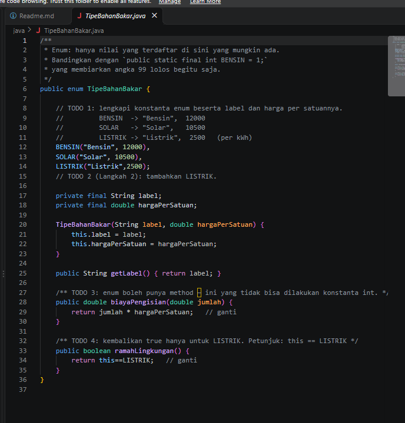

TODO 1 & 2 - Mengubah harga per satuan untuk BENSIN menjadi 12000 dan SOLAR menjadi 10500, serta menambahkan konstanta enum LISTRIK dengan label "Listrik" dan harga 2500.
TODO 3 - Mengubah return value pada method biayaPengisian menjadi perkalian antara jumlah dengan hargaPerSatuan (return jumlah * hargaPerSatuan;).
TODO 4 - Mengubah return value pada method ramahLingkungan menjadi this == LISTRIK sehingga mengembalikan true khusus untuk tipe bahan bakar listrik.

## PHP
a. abstraksi.php

Bukti Screenshot =

- Before :
  
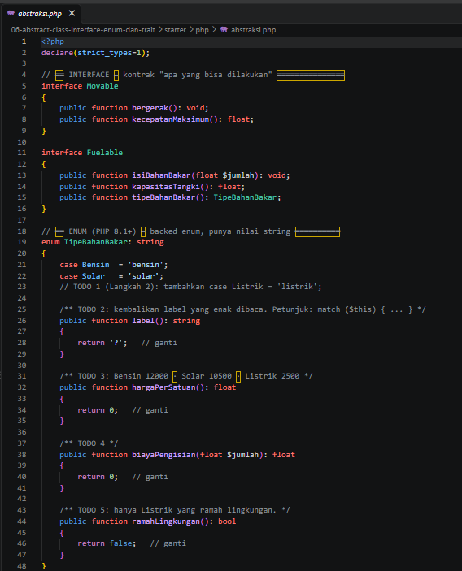
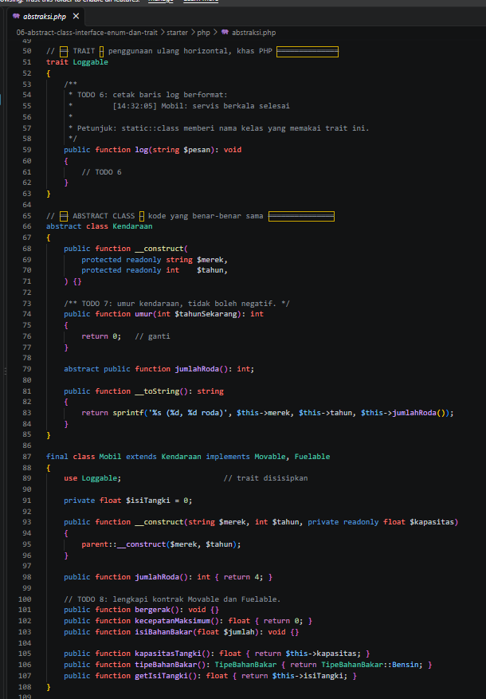
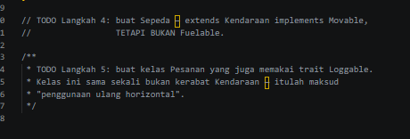

Belum ada case Listrik, serta method label(), hargaPerSatuan(), biayaPengisian(), dan ramahLingkungan() masih mengembalikan nilai default (seperti ?, 0, dan false). Method log() pada trait Loggable masih kosong dan belum berfungsi untuk mencetak log. Method umur() pada kelas abstrak Kendaraan masih mengembalikan nilai statis 0. Kontrak interface Movable dan Fuelable di dalam kelas Mobil masih berupa method kosong atau mengembalikan nilai 0 tanpa implementasi logika nyata. Belum ada kelas Sepeda yang mewarisi Kendaraan dan mengimplementasikan interface Movable, serta belum ada kelas Pesanan independen yang menggunakan trait Loggable.

- After :
  
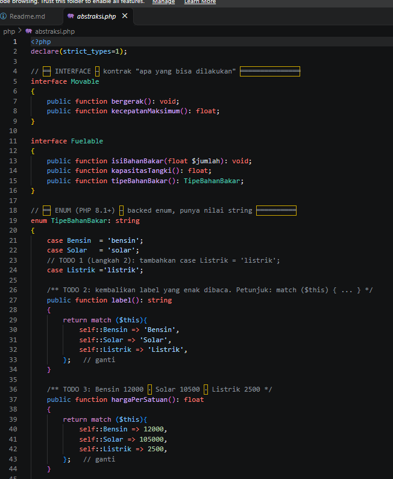
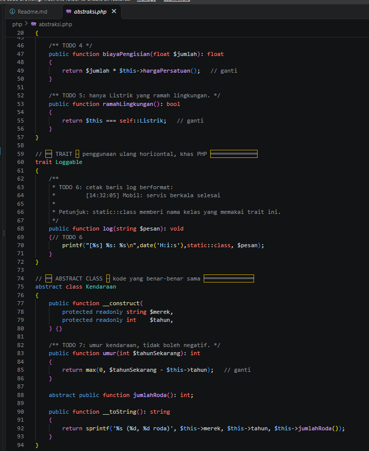
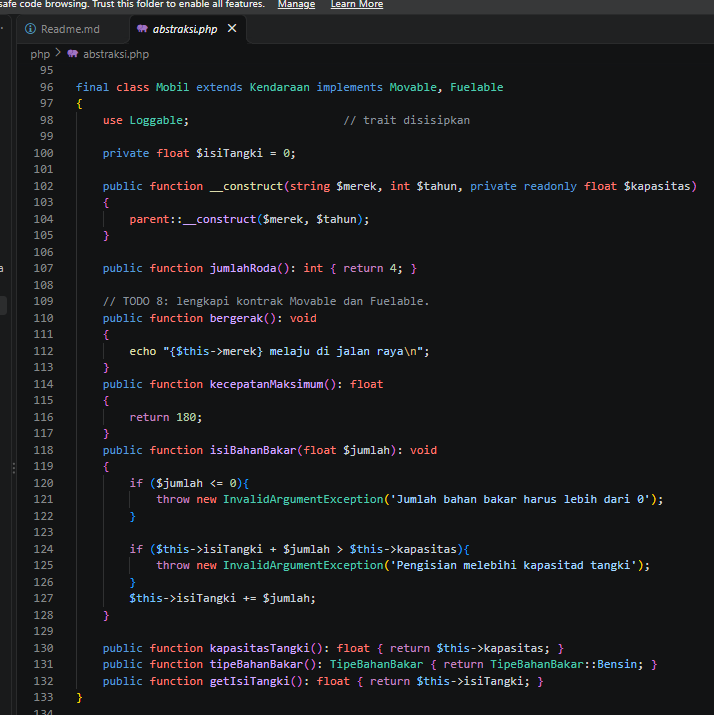
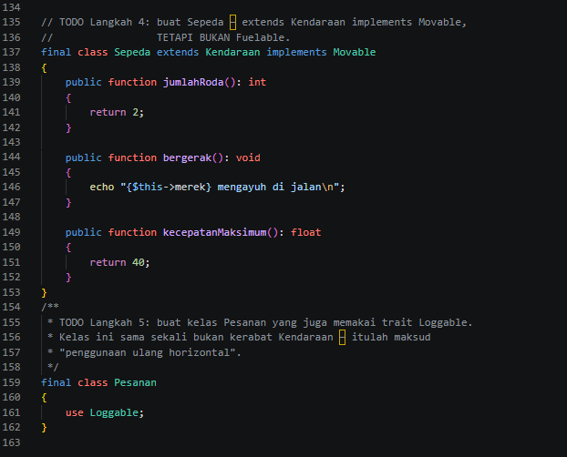

Menambahkan case Listrik = 'listrik', melengkapi method label() dan hargaPerSatuan() menggunakan match, memperbarui rumus biayaPengisian() dengan mengalikan jumlah dan harga per satuan, serta mengaktifkan pengecekan ramahLingkungan() khusus untuk Listrik.  Mengisi method log() menggunakan printf agar dapat mencetak format log secara otomatis disertai waktu (H:i:s) dan nama kelas pemanggil (static::class). Mengimplementasikan rumus perhitungan umur kendaraan menggunakan max(0, $tahunSekarang - $this->tahun) agar hasilnya valid dan tidak bernilai negatif. Melengkapi method bergerak(), kecepatanMaksimum(), serta menambahkan validasi lengkap pada method isiBahanBakar() untuk mencegah nilai negatif dan kelebihan kapasitas tangki. Menambahkan kelas Sepeda yang memperluas Kendaraan khusus untuk kendaraan beroda dua tanpa fitur bahan bakar, serta membuat kelas Pesanan yang menerapkan penggunaan ulang horizontal (horizontal code reuse) menggunakan trait Loggable. 

b. main.php

Bukti Screenshot = 

- Before :
  
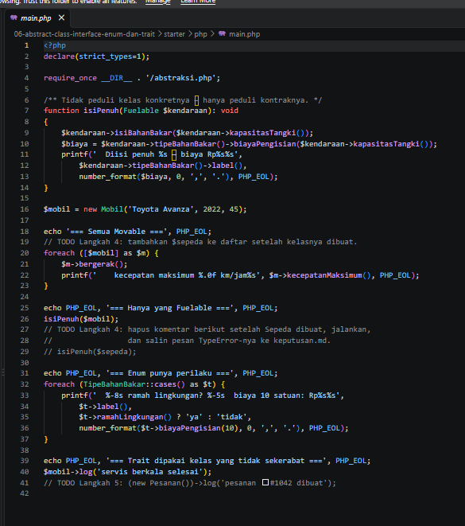
Array perulangan untuk interface Movable hanya berisi objek $mobil saja dan belum menyertakan objek $sepeda. Pemanggilan fungsi isiPenuh($sepeda) masih berada di dalam baris komentar dan belum dieksekusi. Baris kode untuk menguji kelas Pesanan yang menggunakan trait Loggable masih berupa komentar.

- After :
  
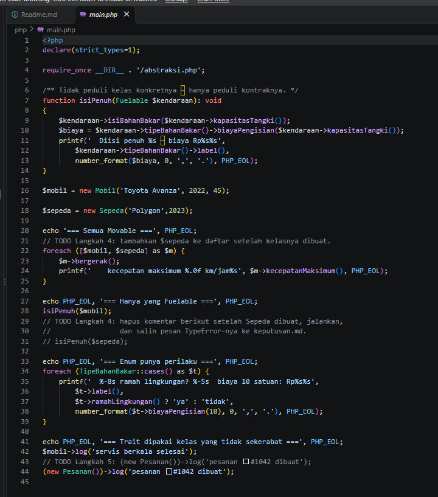

Menambahkan objek $sepeda ke dalam array perulangan [$mobil, $sepeda] sehingga informasi pergerakan dan kecepatan maksimum sepeda ikut ditampilkan. Menghapus tanda komentar pada baris isiPenuh($sepeda) agar fungsi tersebut dijalankan dan memicu error TypeError karena objek sepeda bukan merupakan turunan dari Fuelable. Mengaktifkan baris kode (new Pesanan())->log('pesanan #1042 dibuat') untuk menjalankan fungsi log pada kelas independen yang tidak memiliki hubungan kerabat dengan kelas Kendaraan
